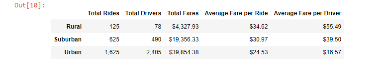

# Pyber with Matplotlib

## Overview

I've been working with my coworker, Omar, at the ridesharing company Pyber to analyze ride data across many cities for our CEO utilizing Pandas DataFrames and the Matplotlib library. This particular assignment entailed creating a summary DataFrame of the ridesharing data by city type - urban, suburban, and rural - and then plotting the data on a multiple-line graph to illustrate the city types' weekly fares across approximately four months so I can provide Pyber with data-driven insights on the differences between the city types to best drive business decisions.

## Results

I began my analysis by digging into the differences between the city types' data as detailed on the summary DataFrame:

We can see right off the bat that there are large disparities between each city type and their respective total rides, drivers, and fares. 
- **Total Rides:** Total suburban rides (625) are five times the total rural rides (125), while total urban rides (1,625) are 2.6 times the total suburban rides - and urban rides are *thirteen* times the total rural rides! 
- **Total Drivers:** At 78 total drivers, our rural cities are 6.3 times less than our suburban drivers (490), which in turn are 4.9 times less than our urban drivers (2,405).  We also have nearly 31 urban drivers for each rural driver. 
- **Total Fares:** Here, our total rural fares ($4,328) are approximately 4.5 times less than our total suburban fares ($19,356), which are roughly 2.1 times less than our total urban fares ($39,854), which, in turn, are 9.2 times more than our total rural fares. 

Our Average Fares per Ride and Driver
