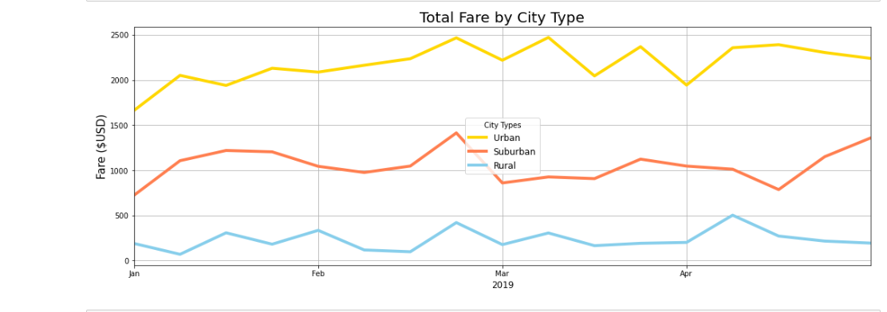

# Pyber with Matplotlib

## Overview

I've been working with my coworker, Omar, at the ridesharing company Pyber to analyze ride data across many cities for our CEO utilizing Pandas DataFrames and the Matplotlib library. This particular assignment entailed creating a summary DataFrame of the ridesharing data by city type - urban, suburban, and rural - and then plotting the data on a multiple-line graph to illustrate the city types' weekly fares across approximately four months so I can provide Pyber with data-driven insights on the differences between the city types to best drive business decisions.

## Results

I began my analysis by digging into the differences between the city types' data as detailed on the summary DataFrame:

We can see right off the bat that there are large disparities between each city type and their respective total rides, drivers, and fares:
- **Total Rides:** Total suburban rides (625) are five times the total rural rides (125), while total urban rides (1,625) are 2.6 times the total suburban rides - and urban rides are *thirteen* times the total rural rides! 
- **Total Drivers:** At 78 total drivers, our rural cities are 6.3 times less than our suburban drivers (490), which in turn are 4.9 times less than our urban drivers (2,405).  We also have nearly 31 urban drivers for each rural driver. 
- **Total Fares:** Here, our total rural fares ($4,328) are approximately 4.5 times less than our total suburban fares ($19,356), which are roughly 2.1 times less than our total urban fares ($39,854), which, in turn, are 9.2 times more than our total rural fares. 

To further summarize, there are 0.62 drivers for every ride in rural cities, 0.78 drivers for every ride in a suburban city, and 1.48 drivers for every ride in an urban city.  

Our Average Fares per Ride and Driver also illustrate large disparities:
- **per Ride:** A rural rider pays an average of $34.62 per ride, which is about 1.12 times greater than the average fare for a suburban driver ($30.97), which, in turn, is about 1.26 times greater than the average urban fare of $24.53. Accordingly, rural riders pay on average abour 1.41 times more than urban riders. 
- **per Driver:** Given all of these differences, it therefore shouldn't be surprising that we also see different average fares for our drivers. Rural drivers pull an average fare of $55.49, 1.4 times more than their suburban counterparts ($39.50). However, both of these figures dwarf our average urban fare of $16.57 (2.38x less than suburban fares and 3.5x less than rural fares). 

From our summary DataFrame, I moved to our multiple-line graph:

In layman's terms, this graph takes our "Total Fares" column from the summary DataFrame and lays it over the four months we're examining, looking at our fares one week at a time - again, split out by each city type. 
There are some interesting patterns here where 2 city types may move in tandem - for example, a rise in fares for urban and rural in the second week of January, while rural fares decline (and the inverse for the first week of February) - and some where all three move in unison, most notably the weeks prior to March, and the weeks following. Without knowing the specifics of what may be happening locally during these time periods, I find it difficult to draw conclusions based on these "in tandem" fare movements, but they may be worth exploring with additional data.
There also *appear* to be seasonal factors affecting the fares brought in - for example, all city types ended January with higher fares than they began, and all except rural ended April with weekly fares significantly higher than they began with in January, although most of the rural fares were higher over the course of the four-month period than they were in the beginning of January. I say "appear" because I'm only looking at a third of a year's worth of data, and really can't draw conclusions without additional data. 

## Summary

Dear V. Isualize:

Thank you for the opportunity to perform these analyses and present my recommendations. 

I would first recommend that we collect and analyze additional data to gain a fuller picture of our business operations. There appear to be patterns of ridesharing behavior illustrated across city types during certain times of the year which raise questions our current data set cannot answer: are local events driving additional, temporary demand for drivers? Additionally, looking at an entire year's worth of data versus four months would allow us to glean a fuller picture of what, if any, seasonal affects are at play on the demand of our services across the spectrum of rural, suburban, and urban cities. 

Second, adjusting our driver numbers to better reflect the total demand for rides would benefit our customer base, our drivers, and our company. We currently have too many drivers in urban cities and not enough drivers in rural and suburban cities. For example, adjusting our overall driver pool to 140 rural, 733 suburban, and 2,100 urban would change our ratios to 1.12, 1.17, and 1.29 drivers per rides in each respective city type, thereby guaranteeing our supply meets rider demand.

Third, we should consider adjusting fare charges for rural cities. At current rates, total rural fares make up less than 7% of our income stream, but rural riders on average pay significantly more than their suburban and rural counterparts. Applying an appropriate percentage discount to our rural fares would not only make our services more affordable for rural residents, but would make our services there more competitive and could potentially make up for a portion of our lost income from the proposed discount. 

Thank you again for this opportunity. 
